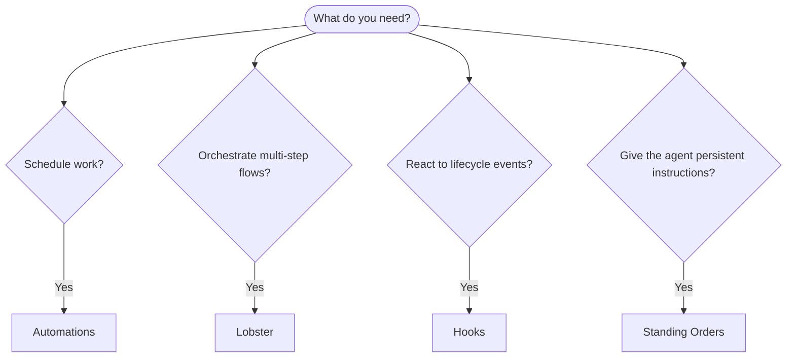

OpenClaw runs work in the background through native runtimes, scheduled jobs, event hooks,
and standing instructions. Use this page to pick the right mechanism.

## Quick decision guide

| Use case                                  | Recommended                                | Why                                                    |
| ----------------------------------------- | ------------------------------------------ | ------------------------------------------------------ |
| Send daily report at 9 AM sharp           | Automations                                | Exact timing, isolated execution                       |
| Remind me in 20 minutes                   | Automations                                | One-shot with precise timing (`--at`)                  |
| Run weekly deep analysis                  | Automations                                | Standalone task, can use different model               |
| Check inbox every 30 min                  | Automations                                | Independent recurring schedule and job history         |
| Trigger safely on new IMAP email          | IMAP plugin                                | Sender-gated isolated reader sessions                  |
| Monitor calendar for upcoming events      | Automations                                | Explicit recurring schedule and delivery policy        |
| Surface ambient main-session updates      | Automations                                | Per-job active hours, idle priority, and quiet results |
| Run a script on session reset             | Hooks                                      | Internal `HOOK.md` scripts react to lifecycle events   |
| Trigger an agent from an external service | [Webhooks](/automation/cron-jobs#webhooks) | Authenticated HTTP ingress, not an internal event hook |
| Execute code on every tool call           | Plugin hooks                               | Typed `api.on(...)` handlers can intercept tool calls  |
| Always check compliance before replying   | Standing Orders                            | Injected into every session automatically              |

<a id="scheduled-tasks-cron-vs-heartbeat" />
<a id="automations-vs-heartbeat" />

### Monitoring with automations

Periodic checks are ordinary editable automations. Give each check its own
instructions, schedule, and delivery policy. Use an active window for quiet hours,
`idleOnly` to give foreground work priority, and private job scratch for a checklist.
Return `NO_REPLY` when there is nothing to report.

Existing heartbeat configuration migrates through `openclaw doctor --fix`.
After migration, the job owns its settings: deleting it stops that monitor,
and a restart or config reload does not recreate it. See
[Heartbeat migration](/gateway/heartbeat).

## Core concepts

### Automations

Automations are OpenClaw's built-in scheduler for all recurring and one-shot
work, including periodic monitoring. The scheduler persists jobs, wakes the agent
at the right time, and can deliver output to a chat channel or webhook endpoint.
It supports one-shot reminders, recurring intervals and cron expressions, and
inbound webhook triggers.

See [Automations](/automation/cron-jobs).

### Background execution and workflows

Use [Sub-agents](/tools/subagents) to launch and wait for delegated runs,
[ACP](/tools/acp-agents) for coding harness sessions, and automation run history
to inspect scheduled work. Each runtime owns execution and completion.

[Lobster](/tools/lobster) runs local pipelines with resumable approvals.
The shared Tasks ledger, TaskFlow orchestration API, and TaskFlow Webhooks plugin
have been removed. Generic [Gateway HTTP hooks](/automation/cron-jobs#webhooks)
remain available for authenticated external triggers.

### Standing orders

Standing orders grant the agent permanent operating authority for defined programs. They live in workspace files (typically `AGENTS.md`) and are injected into every session. Combine with automations for time-based enforcement.

See [Standing Orders](/automation/standing-orders).

### Hooks

Internal hooks are event-driven scripts triggered by agent lifecycle events
(`/new`, `/reset`, `/stop`), session compaction, gateway startup, and message
flow. They are discovered from hook directories and managed with
`openclaw hooks`. For in-process tool-call interception, use
[Plugin hooks](/plugins/hooks).

See [Hooks](/automation/hooks).

<a id="heartbeat" />

### Heartbeat migration

Heartbeat's former periodic monitor is now an ordinary agent-turn automation.
The separate heartbeat execution path is retired. Immediate exec completions,
hooks, and other session notices use normal session execution without waiting
for a periodic monitor.

See [Heartbeat migration](/gateway/heartbeat) and
[Monitoring policies](/automation/cron-jobs/schedules#monitoring-policies).

## How they work together

- **Automations** own every recurring schedule, including reports, reminders, and monitoring.
- **Hooks** react to specific events (session resets, compaction, message flow) with custom scripts. Plugin hooks cover tool calls.
- **Standing orders** give the agent persistent context and authority boundaries.

## Retired inferred commitments

The inferred commitments experiment was removed in v2026.8.1: OpenClaw no longer
extracts follow-ups from conversations or delivers them through heartbeat.
The `openclaw commitments` maintenance CLI is also gone. The database migration
discards the old commitment rows and removes their table and indexes.

For reminders or scheduled work, create an explicit
[automation](/automation/cron-jobs). Automations are an alternative with a
schedule and instructions you choose; they do not restore inferred follow-ups.

## Related

- [Automations](/automation/cron-jobs) — precise scheduling and one-shot reminders
- [IMAP email trigger](/automation/imap) — sender-gated inbound email and isolated reader sessions
- [Hooks](/automation/hooks) — event-driven lifecycle scripts
- [Plugin hooks](/plugins/hooks) — in-process tool, prompt, message, and lifecycle hooks
- [Standing Orders](/automation/standing-orders) — persistent agent instructions
- [Heartbeat migration](/gateway/heartbeat) — migrate periodic monitoring to editable jobs
- [Configuration Reference](/gateway/configuration-reference) — all config keys
