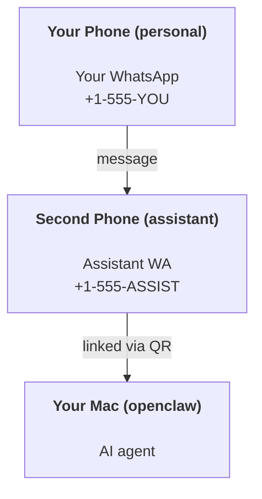

OpenClaw is a self-hosted gateway that connects Discord, Google Chat, iMessage, Matrix, Microsoft Teams, Signal, Slack, Telegram, WhatsApp, Zalo, and more to AI agents. This guide covers the "personal assistant" setup: a dedicated WhatsApp number that behaves like your always-on AI assistant. Setting up a shared gateway for several people instead? See [Team setup](/start/teams).

## Good defaults first

A connected agent is a capable one: depending on your tool policy it can run commands, work with files in its workspace, and message people on your behalf. The defaults keep that power scoped to you; a few settings are worth confirming up front:

- Always set `channels.whatsapp.allowFrom` (never run open-to-the-world on your personal Mac).
- Use a dedicated WhatsApp number for the assistant.
- Review the jobs in `openclaw automations list --all`. Setup creates an ordinary proactive-check job once for the ambient owner; disable it with `openclaw automations disable <job-id>` while you evaluate the setup. Immediate event-driven follow-ups can still run, so keep tool policy and sandboxing conservative until you trust the setup.

## Prerequisites

- OpenClaw installed and onboarded - see [Getting Started](/start/getting-started) if you haven't done this yet
- The WhatsApp plugin installed, or WhatsApp chosen during onboarding. WhatsApp is an official plugin that installs on demand. See [WhatsApp](/channels/whatsapp)
- A second phone number (SIM/eSIM/prepaid) for the assistant

## The two-phone setup (recommended)

You want this:



If you link your personal WhatsApp to OpenClaw, every message to you becomes "agent input". That's rarely what you want.

## 5-minute quick start

1. Pair WhatsApp Web (shows QR; scan with the assistant phone):

```bash
openclaw channels login
```

2. Start the Gateway (leave it running):

```bash
openclaw gateway --port 18789
```

3. Put a minimal config in `~/.openclaw/openclaw.json`:

```json5
{
  gateway: { mode: "local" },
  channels: { whatsapp: { allowFrom: ["+15555550123"] } },
}
```

Now message the assistant number from your allowlisted phone.

When onboarding finishes, OpenClaw auto-opens the dashboard and prints a clean (non-tokenized) link. If the dashboard prompts for auth, paste the configured shared secret into Control UI settings. Onboarding uses a token by default (`gateway.auth.token`), but password auth works too if you switched `gateway.auth.mode` to `password`. To reopen later: `openclaw dashboard`.

## Give the agent a workspace (AGENTS)

OpenClaw reads operating instructions and "memory" from its workspace directory.

By default, OpenClaw uses `~/.openclaw/workspace` as the agent workspace, and creates it (plus starter `AGENTS.md`, `SOUL.md`, `IDENTITY.md`, `USER.md`) automatically on onboarding or first agent run. Put environment-specific tool notes in the `## Tools` section of `AGENTS.md`. `BOOTSTRAP.md` is only created for a brand-new workspace and should not come back after you delete it. `MEMORY.md` is optional and never auto-created; when present, it loads for normal sessions. Subagent sessions only inject `AGENTS.md`.

<Tip>
Treat this folder like OpenClaw's memory and make it a git repo (ideally private) so your `AGENTS.md` and memory files are backed up. If git is installed, brand-new workspaces are auto-initialized with `git init`.
</Tip>

To create the workspace and config folders without running the full onboarding wizard:

```bash
openclaw setup --baseline
```

(Bare `openclaw setup` is an alias for `openclaw onboard` and runs the full interactive wizard.)

Full workspace layout + backup guide: [Agent workspace](/concepts/agent-workspace)
Memory workflow: [Memory](/concepts/memory)

Optional: choose a different workspace with `agents.defaults.workspace` (supports `~`).

```json5
{
  agents: {
    defaults: {
      workspace: "~/.openclaw/workspace",
    },
  },
}
```

If you already ship your own workspace files from a repo, you can disable bootstrap file creation entirely:

```json5
{
  agents: {
    defaults: {
      skipBootstrap: true,
    },
  },
}
```

## The config that turns it into "an assistant"

OpenClaw defaults to a good assistant setup, but you'll usually want to tune:

- persona/instructions in [`SOUL.md`](/concepts/soul)
- thinking defaults (if desired)
- proactive automation jobs (once you trust it)

Example:

```json5
{
  logging: { level: "info" },
  agents: {
    defaults: {
      workspace: "~/.openclaw/workspace",
      thinkingDefault: "high",
      timeoutSeconds: 1800,
    },
    entries: {
      main: {
        groupChat: {
          mentionPatterns: ["@openclaw", "openclaw"],
        },
      },
    },
  },
  channels: {
    whatsapp: {
      allowFrom: ["+15555550123"],
      groups: {
        "*": { requireMention: true },
      },
    },
  },
  session: {
    scope: "per-sender",
    resetTriggers: ["/new", "/reset"],
    reset: {
      mode: "daily",
      atHour: 4,
      idleMinutes: 10080,
    },
  },
}
```

## Sessions and memory

- Session rows, transcript rows, and metadata (token usage, last route, etc): `~/.openclaw/agents/<agentId>/agent/openclaw-agent.sqlite`
- Legacy/archive transcript artifacts: `~/.openclaw/agents/<agentId>/sessions/`
- Legacy row migration source: `~/.openclaw/agents/<agentId>/sessions/sessions.json`
- `/new` or `/reset` starts a fresh session for that chat (configurable via `session.resetTriggers`). If sent alone, OpenClaw acknowledges the reset without invoking the model.
- `/compact [instructions]` compacts the session context and reports the remaining context budget.

<a id="heartbeats-proactive-mode" />

## Proactive automations

Proactive checks are ordinary editable [Automations](/automation/cron-jobs).
Explicit setup provisions a default check once for the ambient owner, normally
every 30 minutes. When that agent uses Anthropic OAuth/token authentication,
including Claude CLI reuse, the provider's setup default is one hour. Later
provider changes do not rewrite an existing job's schedule.

The default check uses the owner's main conversation, gives foreground work
priority, and delivers to a positively identified owner DM. Its instructions
ask it to follow its scratch checklist and relevant context, avoid repeating old
tasks, and return `NO_REPLY` when nothing needs attention. Edit its schedule,
prompt, active hours, or delivery on the **Automations** page or through the CLI:

```bash
openclaw automations list --all
openclaw automations show <job-id>
openclaw automations edit <job-id> --every 30m
openclaw automations scratch <job-id> --set "Check only for newly blocked work."
openclaw automations disable <job-id>
```

The default job sets `skipIfScratchEmpty`: explicitly empty scratch (blank lines,
comments, headings, fence markers, or empty checklist stubs) skips a run. Missing
scratch still runs. Use `--direct-policy block` to block DM delivery, or
`--no-deliver` to disable runner fallback delivery. These policies are stored on
the job, not under agent heartbeat configuration.

Run `openclaw doctor --fix` to migrate supported July 2026 and later heartbeat
configuration and checklists. After migration, edit or remove the job itself;
restarts, config reloads, and later Doctor runs do not recreate a deleted job.
See [Heartbeat migration](/gateway/heartbeat).

Checks run full agent turns, so shorter intervals use more tokens. Immediate
events such as background exec completion use normal session execution and do
not depend on a periodic job being enabled.

## Media in and out

Inbound attachments (images/audio/docs) can be surfaced to your command via templates:

- `{{AttachmentPath}}` (local temp file path)
- `{{AttachmentUrl}}` (original URL or provider reference)
- `{{AttachmentContentType}}` (MIME content type)
- `{{AttachmentDir}}` (directory containing the local path)
- `{{AttachmentIndex}}` (zero-based source fact index)
- `{{Transcript}}` (if audio transcription is enabled)

The older `{{MediaPath}}`, `{{MediaUrl}}`, `{{MediaType}}`, and `{{MediaDir}}`
names remain available as deprecated compatibility aliases.

Outbound attachments from the agent use structured media fields on the message tool or reply payload, such as `media`, `mediaUrl`, `mediaUrls`, `path`, or `filePath`. Example message-tool arguments:

```json
{
  "message": "Here's the screenshot.",
  "mediaUrl": "https://example.com/screenshot.png"
}
```

OpenClaw sends structured media alongside the text. Legacy final assistant replies may still be normalized for compatibility, but tool output, browser output, streaming blocks, and message actions do not parse text as attachment commands.

If you must use a legacy final-reply `MEDIA:` line, keep it as standalone plain
text. Markdown wrappers, code fences, and inline prose such as
`**MEDIA:/path.png**`, `` `MEDIA:/path.png` ``, or
`Here is the image: MEDIA:/path.png` stay text and do not attach media. See
[Rich output protocol](/reference/rich-output-protocol#legacy-media-lines).

Local-path behavior follows the same file-read trust model as the agent:

- If `tools.fs.workspaceOnly` is `true`, outbound local media paths stay restricted to the OpenClaw temp root, the media cache, agent workspace paths, and files generated in the active session sandbox. Files in sibling sandboxes remain inaccessible.
- If `tools.fs.workspaceOnly` is `false`, outbound local media can use host-local files the agent is already allowed to read.
- Local paths can be absolute, workspace-relative, or home-relative with `~/`.
- Host-local sends still only allow media and supported document types (images, audio, video, PDF, Office documents including macro-enabled Excel `.xlsm`, and validated text documents such as Markdown/MD, TXT, JSON, YAML, and YML). This is an extension of the existing host-read trust boundary, not a secret scanner: if the agent can read a host-local `secret.txt` or `config.json`, it can attach that file when the extension and content validation match. File-type validation does not establish that an attached workbook's macros are safe to run.

Keep sensitive files outside the agent-readable filesystem, or keep `tools.fs.workspaceOnly: true` for stricter local-path sends.

When the message tool cannot stage an attachment for the current conversation,
its error identifies the file and the reported reason, such as a missing file or
an unsupported local format. Being inside the workspace does not make every
file type eligible for host-local attachment reads.

## Operations checklist

```bash
openclaw status          # local status (creds, sessions, queued events)
openclaw status --all    # full diagnosis (read-only, pasteable)
openclaw status --deep   # check channels (WhatsApp Web + Telegram + Discord + Slack + Signal)
openclaw health --json   # gateway health snapshot over the WS connection
```

Logs live under `/tmp/openclaw/`: `openclaw-YYYY-MM-DD.log` for the default
profile and `openclaw-<profile>-YYYY-MM-DD.log` for named profiles.

## Next steps

- WebChat: [WebChat](/web/webchat)
- Gateway ops: [Gateway runbook](/gateway)
- Cron + wakeups: [Cron jobs](/automation/cron-jobs)
- macOS menu bar companion: [OpenClaw macOS app](/platforms/macos)
- iOS node app: [iOS app](/platforms/ios)
- Android node app: [Android app](/platforms/android)
- Windows Hub: [Windows](/platforms/windows)
- Linux status: [Linux app](/platforms/linux)
- Security: [Security](/gateway/security)

## Related

- [Getting started](/start/getting-started)
- [Setup](/start/setup)
- [Channels overview](/channels)
